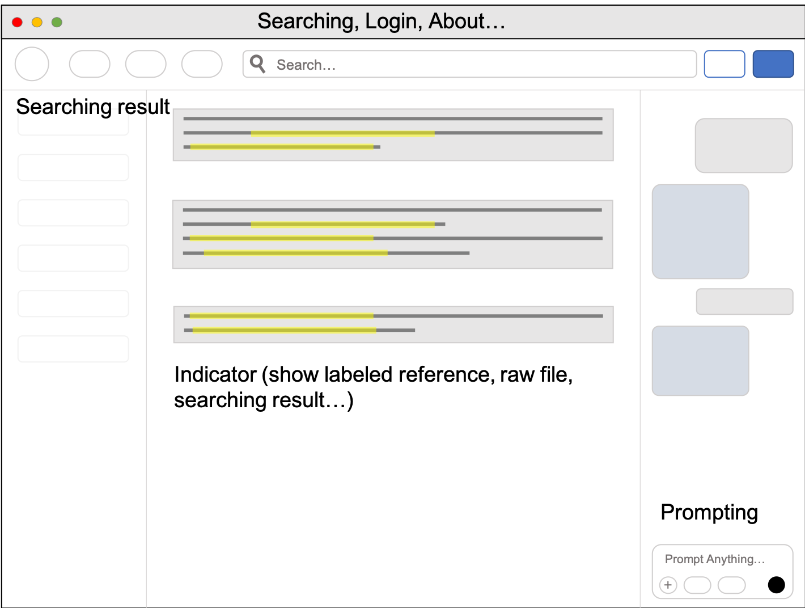

APP Development
===
Environment
---
### 1. Install node js

```
    curl -fsSL https://deb.nodesource.com/setup_22.x | sudo -E bash -
    sudo apt-get install nodejs
```

### 2. Initial vite and electron framework

```
    mkdir your-workspace && cd your-workspace
    npm create electron-vite@latest DocumentRAG
    cd DocumentRAG
    npm install
```

### 3. Install essential

``` 
    npm install openai
    npm install chromadb
    npm install ollama
```

### 4. Install Ollama

    Download from link: https://ollama.com

### 5. Install Chroma
    
```
    pip install chromadb
    mkdir -p ~/.chromadb
    chroma run --path ${HOME}/.chromadb
```

### 6. Pull model from ollama and add ModelFile

```
    ollama pull llama3
    mkdir -p ~/.ollama/modelfile
    vim ~/.ollama/modelfile/ModelFile
    ollama create llama3-tuned -f Modelfile
```

``` ModelFile
    # ModelFile
    FROM llama3:latest
    SYSTEM """instruction or identity here"""
```

```
    ollama list
    ollama run llama3-tuned
```

Project Framework
---

#### React UI Layer
___
##### - User prompts
##### - Other operations (Download files...)

#### Electron Main Layer (Backend)
---
##### - User prompts -> ChromaDB -> Retrieved Data
##### - Retrieved Data + User prompts -> Llama3 (tuned) -> Response
##### - Response -> React UI Layer
##### - Hidden Layer (ChromaDB Server)

UI Layout Design
---



Interfaces
---

### Prompting

UploadFile: Button
___

SearchOnInternet: ToggleButton
___

ReferenceSettings: DropdownMenu
___

PromptText: InputTextBox
___

ResponseText: TextBox
___

### Indicator

ShowText: TextBox
___

ShowFigure: FigureBox
___

ShowReference: LocalLink
___

### Searching Result

ResultList: ItemList
___

ResultItem: LocalLink \ RemoteLink
___

### Header

SearchBox: InputTextBox
___

Signin: Button
___

Login: Button
___

About: Button
___

Help: Button
___

Logo: Icon
___